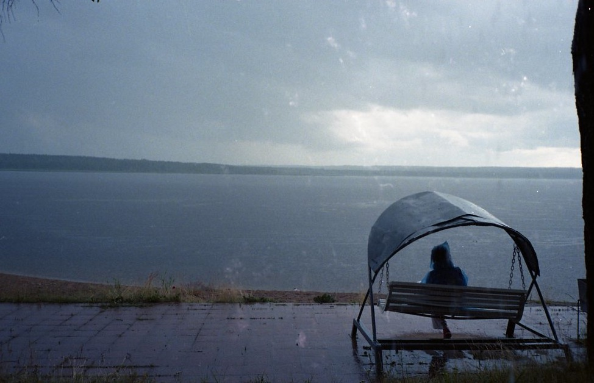
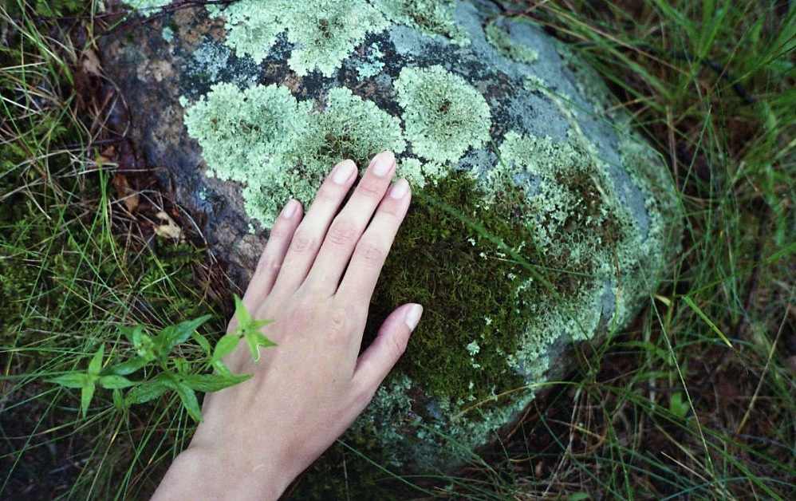

# Лодочки, мосты и бурная вода

## В Лосево есть всё

И это чистая правда! Тем, кто не побоится провести два часа в электричке, скучать точно не придется. В Лосево вас первым делом встретит бурная река Вуокса, где можно при желании сплавляться на рафтах. На туристической базе возле спокойного разлива реки можно взять на прокат лодочку и вдохновенно грести, наслаждаясь видами, можно сидеть на лавочках, лежать на лежаночках, заиматься шведской ходьбой, кататься на велосипедах, купаться, гулять, фоткаться на фоне железнодорожных мостов, кидать камни в водовороты… Летом на турбазе дают концерты, есть бар, а в поселке можно закупиться копченой рыбой. Подкрепиться можно в кафешках или купить еды в универсаме и устроить пикник. Добавьте ко всему этому мхи, камни, чернику и все остальное великолепие природы Карельского перешейка, и что, вы еще не на пути к вокзалу?!

## Всегда солнечно в Лосево

На самом деле нет. Но там точно хорошо и под палящим солнцем, и в грозу. Говорю как человек, который в Лосево испытал на себе все возможные проявления капризного северного лета.

Первый раз я была там довольно давно и уже неправда. Погода была хороша, был багет и был сыр, мы долго шли не в ту сторону, купались в ледяной Вуоксе, и только под конец дня попали на турбазу, где и застали летний концерт злачной областной эстрады.

А вот во второй мой приезд случился погодный апокалипсис, и теперь мне уже вообще никакие климатические коленца никогда не будут страшны, я выдержу любой дождь (был бы дождевик), и при любом раскладе получу удовольствие от  поездки.

Так вот, я поехала одна и неладное почуяла уже за две станции до Лосево. Небо насупило густые брови туч, кто-то выкрутил яркость солнечного света, и, когда я вышла из вагона, разразилась настоящая гроза. Всё как полагается: с громами и молниями, с проливным дождем и запахом мокрой пыли. Но я не растерялась и побежала прятаться под мост.

Там я сидела на бетонных плитах часа два, попивала чаек из термоса, смотрела на пороги и ребят, которые сплавлялись на рафтах - им дождь был нипочем.

И это было круто: чай, и мосты, и гроза, отчаянные крики рафтеров… Одно из самых ярких воспоминаний.

Дождь унялся, я пошла через поселок к турбазе и спокойной воде. По дороге зашла в магазин “Верный”, купила еды, поглазела череду рыбнах киосков: в витринах жирные ароматные скумбрии, тощие сухие камбалы, и другие рыбины, названий которых я не знаю. Рыба там на любой вкус - это точно, а вот про цены ничего сказать не могу, не сравнивала.

На турбазе было пусто, отдыхающие спрятались. Тихо, сыро и свежо.

Я прошла к берегу тихой части Вуоксы, гуляла среди елочек с крупными каплями на лапах и мокрых камней, покрытых мхом. Воздух после грозы был бодрый и дышалось легко, вдалеке кто-то катался на лодочке.

А потом небо потемнело и снова зарядил дождь. Я спряталась под навесом летней кухни, там стояли столики и лавки, снова достала термос, еду. Сидела так не меньше часа, пока дождь не перестал. Со мной вместе под навесом пряталась семья с ребенком, а прямо возле воды на качелях девушка в дождевике читала книгу.

По озеру всё также тихо скользила лодочка, как будто и нет никакого дождя, как будто в Лосево и правда всегда солнечно. Только на свой, северный прекрасный лад.

Потом я снова гуляла, наслаждалась природой, трогала мокрый мох и долго-долго следила за постоянно меняющимся рисунком сумасшедшей воды на лосевских порогах.

Затем я пошла на станцию, до электрички оставался еще час и я успела посидеть у Суходольского озера (в него впадает Вуокса). Наткнулась на небольшой палаточный лагерь студентов и на любителей шашлыков.

Моя электричка не пришла. Не пришла и следующая, я изучила все окрестные мосты. Из-за грозы что-то там оборвалось и никто не знал, нужно ждать или нет. На станции нет ни информации, ни касс. Команда усталых любителей сплава не выдержала и стала собирать народ ехать на такси до станции Сосново, откуда по слухам должна была всё-таки выехать электричка в Петербург. Им не хватало двух человек в машину, и я вписалась. Лихое областное такси! На поворотах я зажмуривалась, как на американских горках. Электричка из Сосново, действительно, отправлялась.

А когда я сошла на станции Мурино в Петербурге, оказалось, что в этом районе прошел град. Повсюду лежали горы-сугробы. Помню клумбы бархатцев в снегу на Гражданском проспекте. Но мне уже ничего не могло удивить, я люблю северное лето, даже если идет снег.

## Всем в Лосево!

В Лосево можно и нужно приезжать с собаками и с детьми, занятие найдется для всех. Хорошо приезжать с палатками или останавливаться в домиках на турбазе. В прокате много разного инвентаря: лодки, велосипеды, рафты. Минимальная инфраструктура есть, можно купить любые продукты или поесть в кафе. В поселке продается копченая и свежая рыба.

Главное, что отличает это место от других - разнообразие и удобство. Массивные конструкции мостов, пороги, рафты, тихие лодочки, лежаки у воды, шикарная природа. Не нужно тащить с собой из города еду или снаряжение - все можно достать на месте.

Даже если у вас нет никакой конкретой цели (как не было её у меня), вы не хотите грести, купаться, есть рыбу или сплавляться, вам все равно наверняка понравится в Лосево. Там очень приятно гулять, пейзажи сменяют друг друга и перед глазами всё время разное, интересное, новое. И в Лосево всегда солнечно!