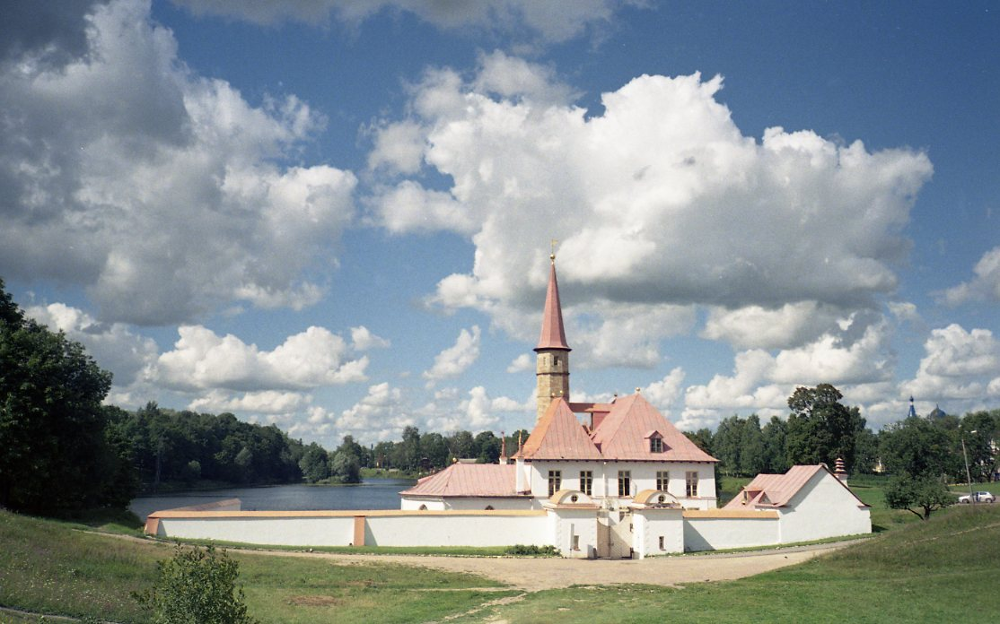

# Архитектурно-парковый винегрет

## Гулять не перегулять

В Гатчине я провела всего один день, нагулялась по полной программе и посмотрела при этом далеко не всё. Нужно возвращаться опять и снова, там много всего на любой вкус. Два потрясающих парка (один более дикий и природный, второй более “дворцовый” и туристический), озера, поля, тропинки, лавочки, островки. Плюс россыпь объектов архитертуры: ворота, гроты, мосты, дворцы, заброшенная башня… На прогулке в Гатчине скучать не придется!

## Прогулки: иторические и не только

В Гатчину я поехала совершенно теоретически неподкованной. В общем-то меня редко интересуют углубленные исторические подробности и я не стремлюсь сфотографировать все достопримечательности. Садясь в электричку, я не знала, чего ожидать и какая прогулка мне предстоит. А получилось всё супер-насыщенно и интересно. Даже если ничего заранее не читать, а просто приехать и идти вперед - получится незабываемая прогулка. Гатчина - чудесное место, я точно туда еще съезжу и не раз.

Для любителей углубиться в прошлое Российской Империи это место будет еще более привлекательным: история здесь набрасывается из-за каждого угла и сквозит из всех щелей.

Доехала до Гатчины-Варшавской и сразу попала в Приоратский парк. Парк этот ухоженный и чистый, но он не перегружен туристическими заманухами и поэтому не такой популярный, остался диким и природным. В нем много красивых тропинок и дорожек, лугов, озер и островков. Очень хорошо в Приоратском парке просто гулять, наслаждаясь природой, или устраивать тихие пикники.

Первое сооружение, которое я встретила - заброшенная башня. Людей вокруг не было совсем, я побегала по полю вокруг, пофотографировала, зашла внутрь (внутри - ничего). Довольно много времени уделила башне, не зная еще, сколько всего ждет впереди.

Пошла дальше, лесом-полем, полем-лесом. Встретилась мне только девушка с коляской да дедушка с велосипедом. Все очень пасторально, только барашков не хватало. И вот через некоторое время передо мной открылся вид на очень необычный дворец - Приоратский.

Сам дворец был закрыт, поэтому я просто полюбовалась им с разных сторон. Расположен он в природной ложбине, на берегу замечательного Черного озера, и окружен холмами. Если забраться на холм, открывается потрясающий вид на воду и островок с деревьями.

Затем я обогнула озеро, перешла дорогу и через красивые Адмиралтейские ворота попала в Дворцовый парк. Сразу же поняла, что этот парк отличается от предыдущего: меня встретила большая табличка с картой и указанием всех достопримечательностей, вокруг ходили туристы, дорожки были более широкими.

Я пыталась запомнить карту, даже сфотографировала её, но в итоге так и не воспользовалась, просто самостоятельно исследовала парк. Сколько же там всего! Павильоны, арки, порталы, мосты, домик из березовых стволов… Объекты раскиданы по всему парку то тут, то там.

Конечно же, Большой Гатчинский Дворец, прекрасный со всех сторон. В него можно заходить по билетам, но я не стала. Возле дворца есть красивый сад, туда вход также платный. Перед южным фасадом - огромный песчаный плац.

С других сторон дворец окружен деревьями, зелеными полями и тоже весьма симпатичен.

Обойдя несколько раз вокруг дворца, я еще долго ходила по парку, изучая разные постройки. Но все они были как будто затеряны среди зелени. Озёра, Белое и Серебряное, создают простор, на берегу много лавочек и можно посидеть у воды.

Под вечер я сильно проголодалась, еды в парках нет вообще никакой, ни одной палатки или киоска, воды тоже негде было купить. Поэтому я снова вышла к южному фасаду Гатчинского дворца и пошла на автобусную остановку, там уже были какие-то захудалые магазинчики. Автобус довёз меня до метро Автово...

## Всем в Гатчину!

В Гатчину лучше всего ехать в хорошую погоду, чтобы можно было беспрепятственно наслаждаться прогулкой. Берите детей и собак, и обязательно еду и воду.

Можно приезжать просто так по наитию и гулять, а можно заблаговременно почитать парочку статей, взять экскурсию во дворцы, воочию увидеть исторические места.

В Гатчине, без сомнений, будет интересно всем: и любителем простых прогулок на природе, и тем, кого привлекает посещение дворцов и музеев. При этом Гатчина не такое пафосное и напыщенное место, как Царское Село, например. Там нет толп туристов, нет очередей на вход во дворец, вход в парк бесплатный. Атмосфера спокойная и расслабленная.

Всем в Гатчину!)