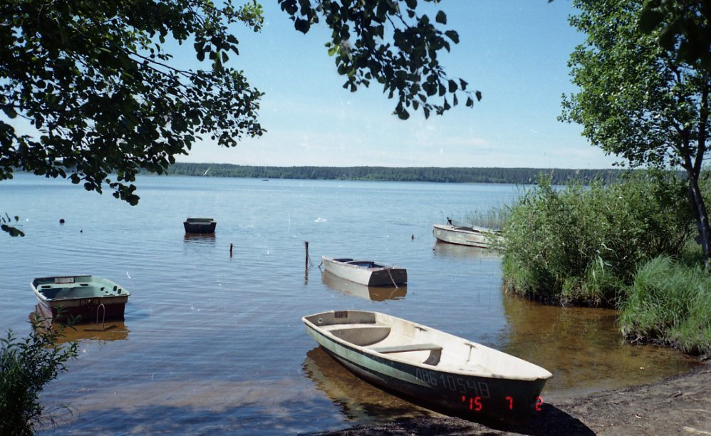
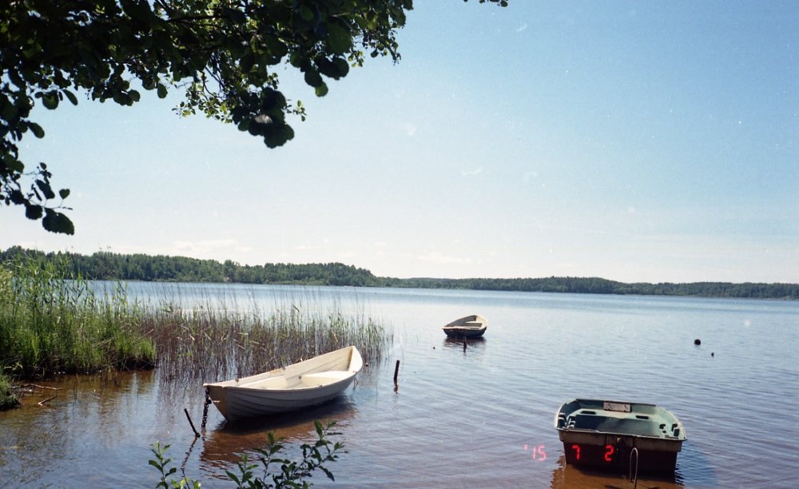
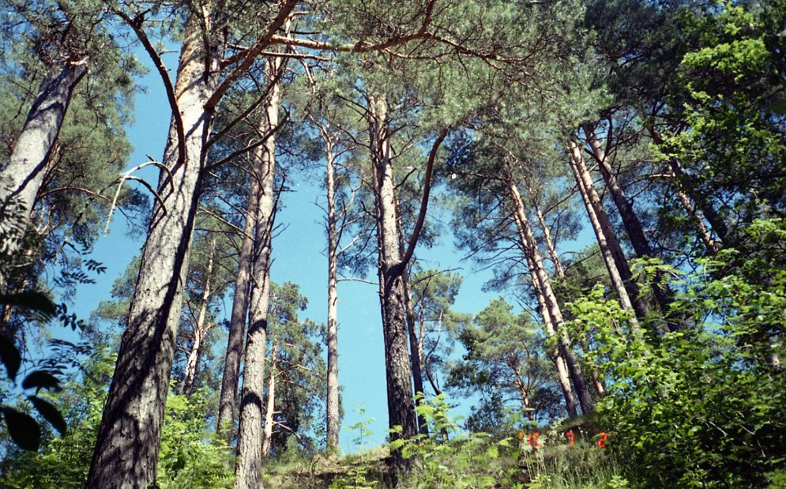
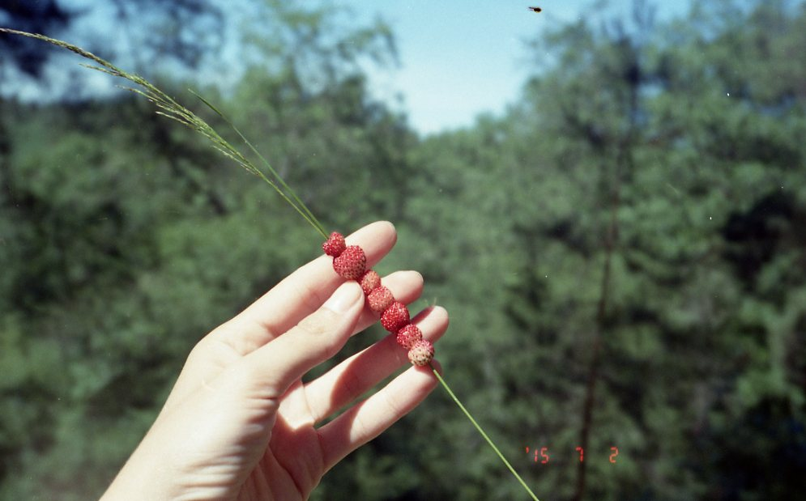
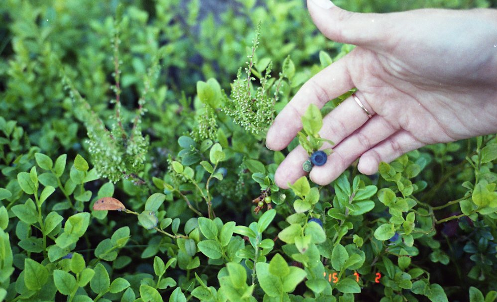
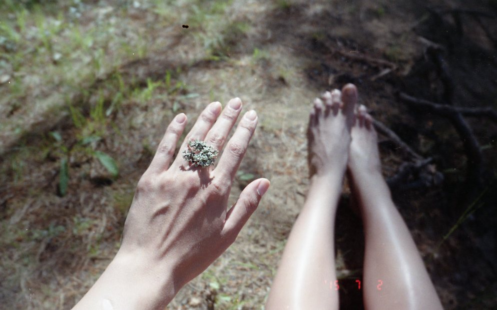
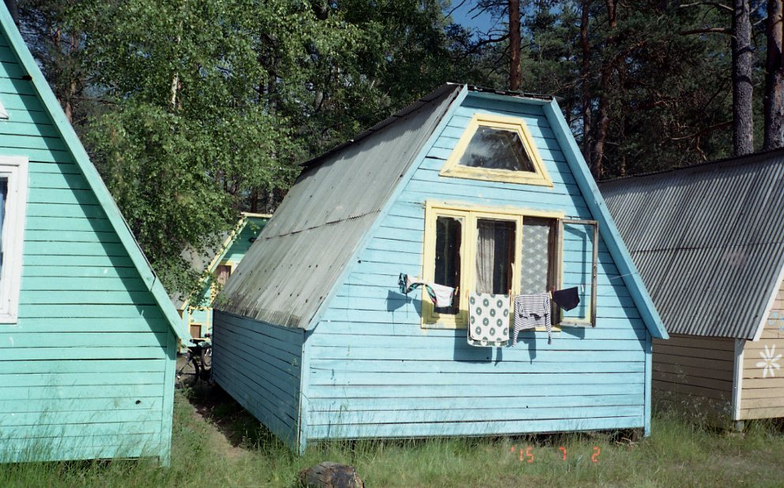

# Перейди это озеро вброд

## Озеро, просто озеро

В первом приближении - да. Обычное озеро, никаких развлечений, прокатов, никаких кафешек или крутых туристических баз. Бесхитростно. Но на самом деле у Лемболовского озера как минимум три козырных туза в рукаве. Во-первых, озеро очень мелкое, чистое и теплое. Одно из самых приятных мест для купания с детьми и собаками, которое я встречала. Во-вторых, совершенно феерический лес вокруг. Чистый, светлый, сосновый. Стройные стволы сосен уходят прямо в небо, мягкий ласковый мох, белый песок, черника и земляника. В-третьих, тишина. Озеро окружено лесом, дачами и полудикими туристическими базами с летними домиками. Это красивое и чистое место, не обезображенное цивилизацией. В хорошую погоду приехать туда с семьей чтобы погулять по лесу и порезвиться в теплой воде - идеально.

## В поисках лучшего пляжа

Мне повезло с погодой: совершенно летняя, сухая и горячая, в такую погоду только и делать, что в озере купаться да на берегу сидеть.

Я вышла на платформе 54 км. На станции есть небольшой магазинчик, где можно купить самую необходимую еду или воду. К озеру я прошла довольно быстро, нужно было просто спуститься по дорожке через дачи, и сразу наткнулась на пристанище лодочек.

Пляжа видно не было, я не знала в какую сторону мне идти, поэтому подкараулила лодочника и спросила. Вообще общаться с аборигенами - всегда полезно. Оказалось, что пляж всего буквально в десяти метрах на север.

Несколько семей с детьми, все резвятся и кричат. Молодая пара с большой мокрой собакой, носятся и поднимают брызги. Я положила вещи, разулась и зашла в воду. Песок чистый и приятный, вода чистая и теплая, я пошла вперед. Шла и шла, шла и шла. В общем, вода дошла до уровня шорт чуть ли не к середине озера. За мной увязались мальчишки, но их быстро отозвали: нечего, мол. Я постояла, посмотрела на пляж издалека. Он показался мне маленьким и переполненным. Наверное, все дачники ходили сюда купаться и загорать. Я вышла на сушу, обулась и черт понес меня вдоль берега на север: я решила найти лучший пляж.

Дорожка оказалась совершенно дикой и безлюдной, но какой же лес был вокруг! Вот такой:

Это Карельский перешеек, детка! Озеро находится в ложбине, и все деревья стоят на горке, отчего кажутся еще выше. Пятнадцать минут ходу и я вышла на еще один пляж, больше прежнего. Там тоже хватало отдыхающих, но они были с туристической базы. Я немного походила по воде, а затем забралась на горку, выбрала симпатичную песчаную полянку и устроилась на пикник. Вокруг меня лежали шишки, росли кустики черники и земляники. Сверху я наблюдала за озером и купальщиками и нарвала жменю ягод, не вставая с места.

Оба пляжа были приятные и публика хорошая: никаких шашлыков, никакого дебоша с алкоголем, машины к берегу тоже подъехать не могут. Отдыхающие, семьи, собаки. Хорошо и спокойно.

Назад я решила идти не вдоль берега, а через лес. Вышла к туристической базе: летние домики, открытые столики для еды, рукомойники, столы для настолького тенниса. Кругом всё тот же светный, просторный и высокий лес.

Телефон мой к тому времени разрядился и мне пришлось спрашивать дорогу у местных “жителей”, все были очень дружелюбны. Молодая семья с ребенком в коляске даже прошлась со мной, чтобы показать дырку в заборе: они знали короткий путь.

Довольно быстро я добралась до платформы 54 км и уехала домой.

## Много солнца в теплой воде

К Лемболовскому озеру однозначно стоит ехать в хорошую погоду, чтобы спокойно провести время среди красивого леса и искупаться в приятной воде. Еду необходимо брать с собой, можно брать палатки или арендовать домик на туристической базе. Идеально для семей с детьми и любителей спокойного отдыха на природе, без комфорта цивилизации и дополнительных развлечений.