# Зеленогорск: Цивилизованное море

[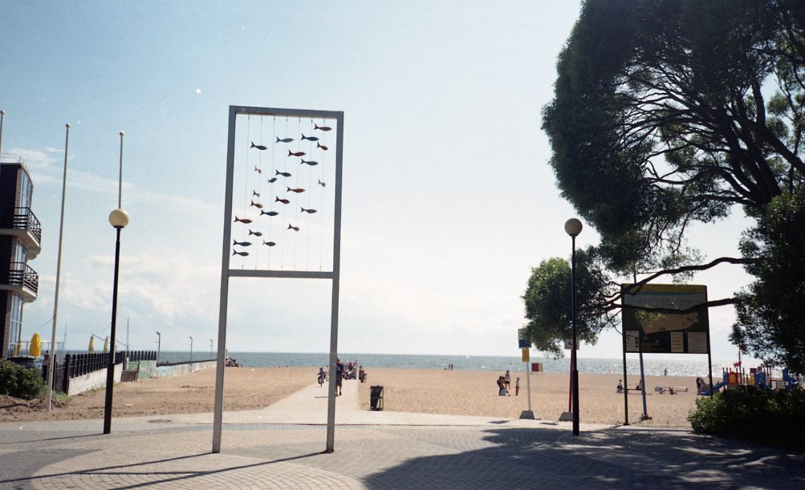](photos/01.jpg)

## Зеленогорск - это удобно

Поездка в Зеленогорск - идеальный выбор для тех, кто хочет отдохнуть на море, не слишком погружаясь в дикие природные условия. Не нужно больше выбирать между желанием поваляться на пляже и бытовым комфортом - просто поезжайте в Зеленогорск. Это курортный город и там есть все блага - начиная от магазина “О’Кей”, заканчивая музеем ретро-автомобилей и колесом обозрения.

## Курортные достопримечательности и благоустроенный пляж

Удобства начинаются уже на этапе выбора транспорта: в Зеленогорск ходят экспресс-электрички, которые за минут двадцать без лишних остановок домчат вас от Удельной или Финляндского вокзала. Ходят они достаточно редко, но можно подобрать удобный по времени вариант.

Вокзал в Зеленогорске - красивое воздушное здание с огромными стеклами - уже засуживает внимания. Возле вокзала есть торговый центр, магазин “О’Кей”, аптека. Можно купить еды прямо там, но можно этого и не делать - в городе есть маленькие магазинчики, кафешки, на пляже тоже можно купить еды.

Чтобы дойти до пляжа, вам предстоит пройти по прямой через город. По пути вам встретятся малые городские скульптуры, например, памятник таксе. Но я не большой поклонник подобного творчества, мне больше понравилась лютеранская кирха.

[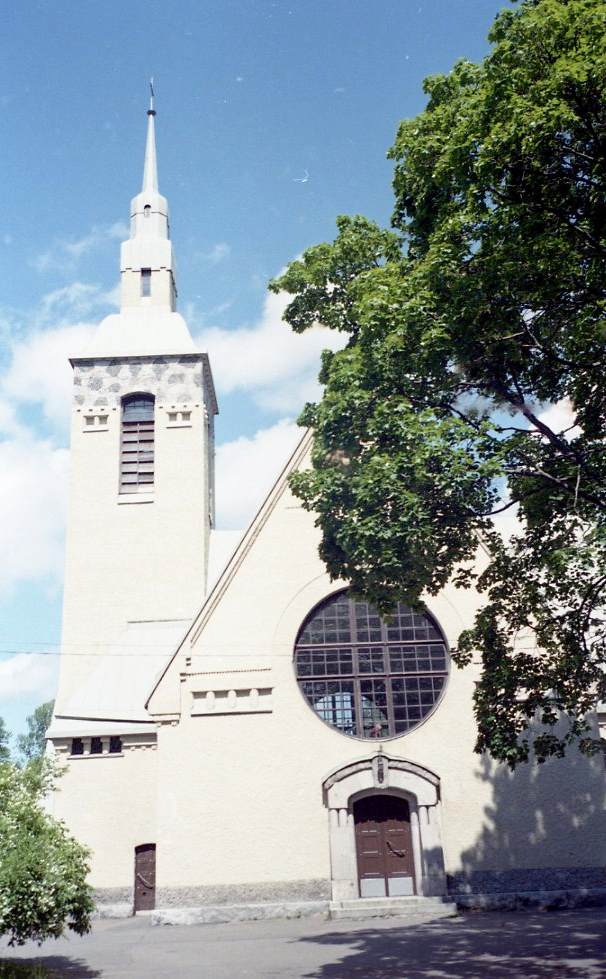](photos/02.jpg)

В нее можно зайти, внутри тоже очень интересно.

[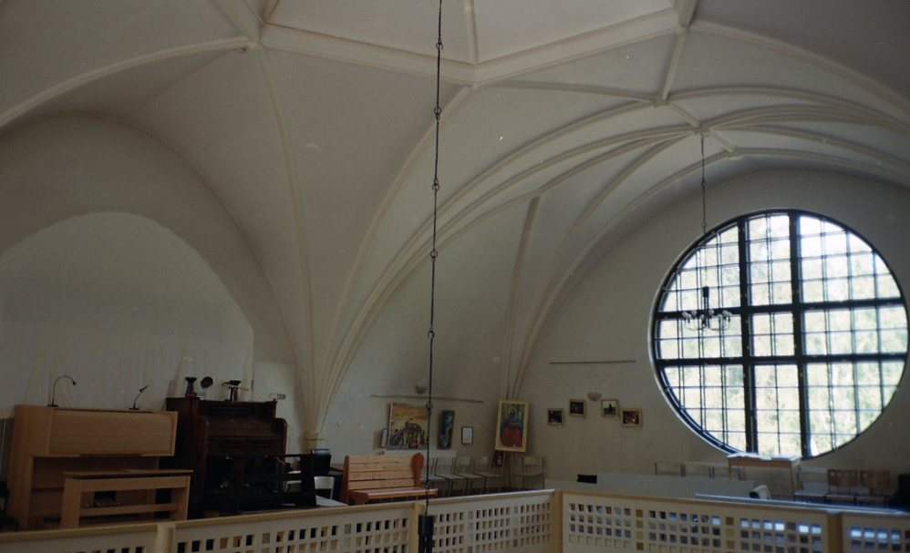](photos/03.jpg)

[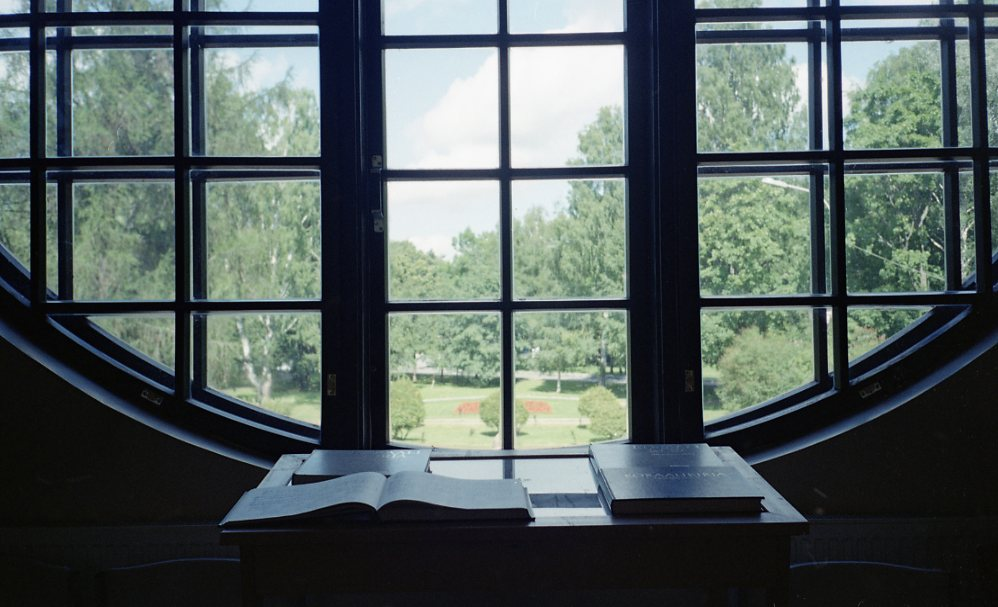](photos/04.jpg)

В городе царит курортная атмосфера. С одной стороны, есть вся инфраструктура: бары, библиотеки, магазины. С дургой стороны, всё покрыто налётом советского курорта:

[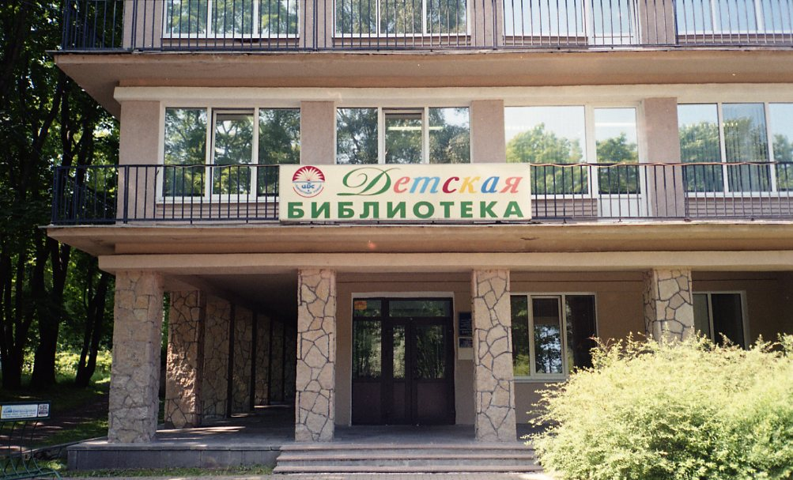](photos/05.jpg)

Но это хорошее ощущение, радостное. Как будто ты в дургой город на отдых приехал, как будто ты турист, хотя всего-то двадцать минут на электричке мчался. Можно даже фоткаться с памятниками или малыми городскими скульптурами, которые повсюду. Возле детской библиотеки, например, сидит читающий муравей, в кадр он не вошел.

Ближе к пляжу расположено советское монументальное здание школы и перед ним - памятник Ленину. Здание закрыто, к нему близко пройти нельзя (если только не перелезть через забор), можно только снаружи полюбоваться.

[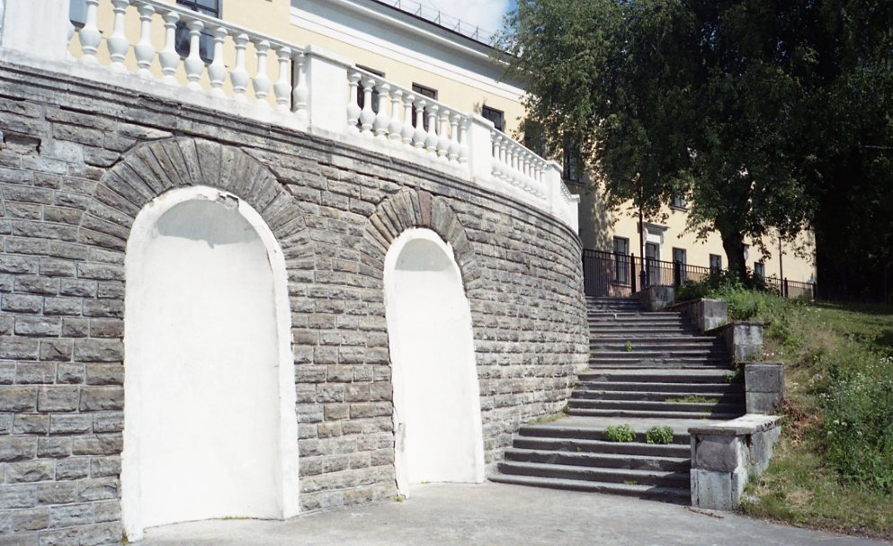](photos/06.jpg)

Сразу за зданием начинается парк. Парк полон разнообразных увеселений: опять малые скульптуры (памятник Георгию Вицину, который на него совершенно не похож, какие-то гигантские ботинки, в которых все фотографируются), киоски с морожком и фаст-фудом, детские аттракционы, чуть глубже в парке есть музей ретро-автомобилей, прокат роликовых коньков… В общем, если вы приедете с детьми, они точно найдут себе много занятий. Если вы без детей и не особо любите всякие общественно-парковые плюшки, смело проходите через главную аллею прямо к пляжу. Там есть колесо обозрения и, собственно, сам пляж. Лично я не смогла устоять и первым делом всё-таки полезла на колесо:

[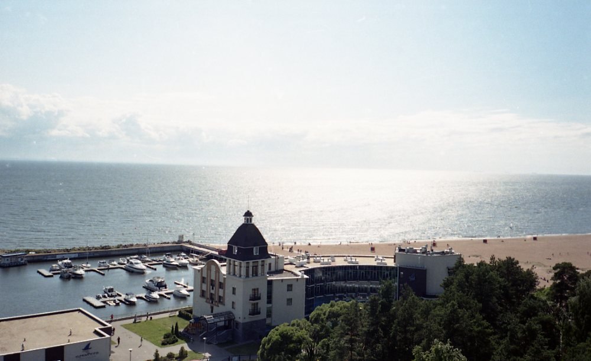](photos/07.jpg)

[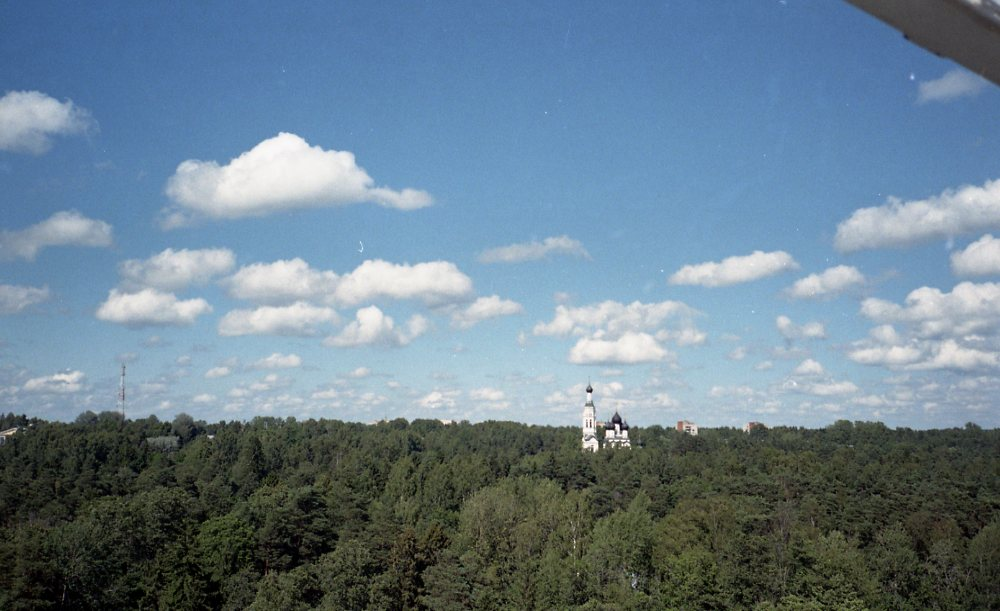](photos/08.jpg)

А потом уже отправилась на пляж. Он очень милый, чистый и ухоженный, есть две бетонные дорожки, вдоль которых стоят скамейки, можно посидеть и переобуться. На самом пляже также то тут то там стоят лавочки.

[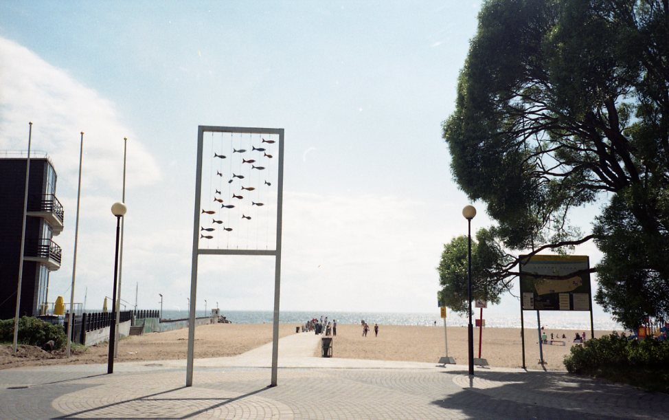](photos/09.jpg)

Людей на пляже, нужно сказать, много. Но места, впрочем, тоже много, да и Финский залив никогда не бывает уж слишком теплым, так что и на песке, и в воде пространства хватает всем желающим. Территория чистая, мусора почти нет.

[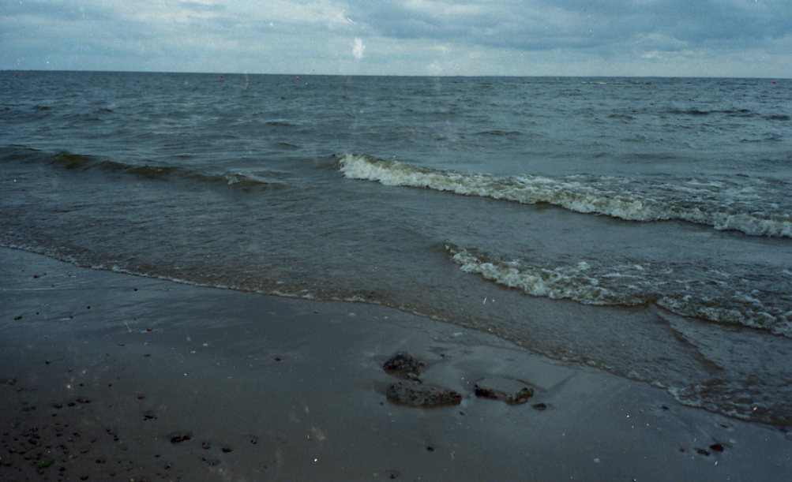](photos/10.jpg)

Если устанете лежать на пляже, можно побродить по нецентральным аллеям парка или по улочкам города. Путеводители пишут, что там можно найти какие-то интересные постройки дач, но всё что я нашла было разрушенным или обнесенным высочеными заборами. Так что лучше еще на море поглядеть:

[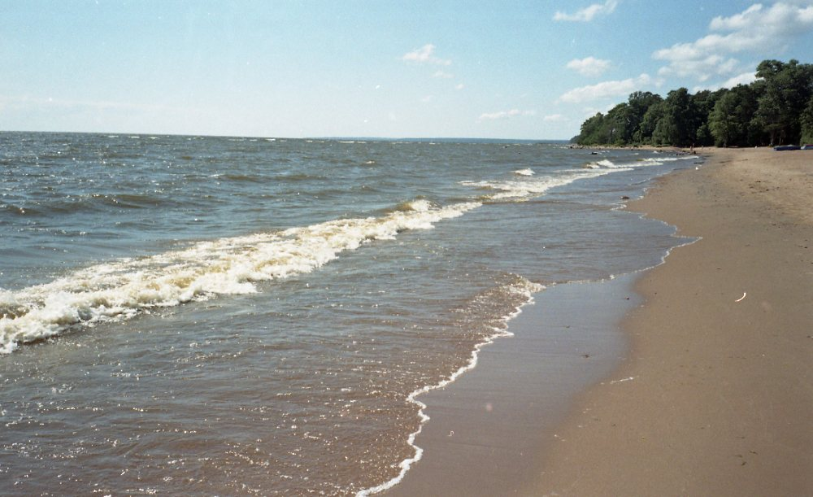](photos/11.jpg)

Вернуться из Зеленогорска в город не составляет труда. На выбор маршрутки, автобусы, электрички.. Всё зависит от того, в какой части города вы живете. Мне до станции Шувалово удобнее всего ехать на электричке, поэтому я просто вернулась обратно на вокзал, а маршрутки и автобусы ходят от парка и от вокзала.

## Турист на час

Если хотите почувствовать себя туристом на курорте, посетить кирху, поглазеть на памятники, отдохнуть в парке, искупаться в море и при этом не думать о том, где достать еды и чем занять детей - то я очень советую ехать в Зеленогорск. Это удобно, это быстро, и не нужна никакая дополнительная подготовка или снаряжение. А море, оно и в Зеленогорске море - прекрасное, живое и незабываемое.