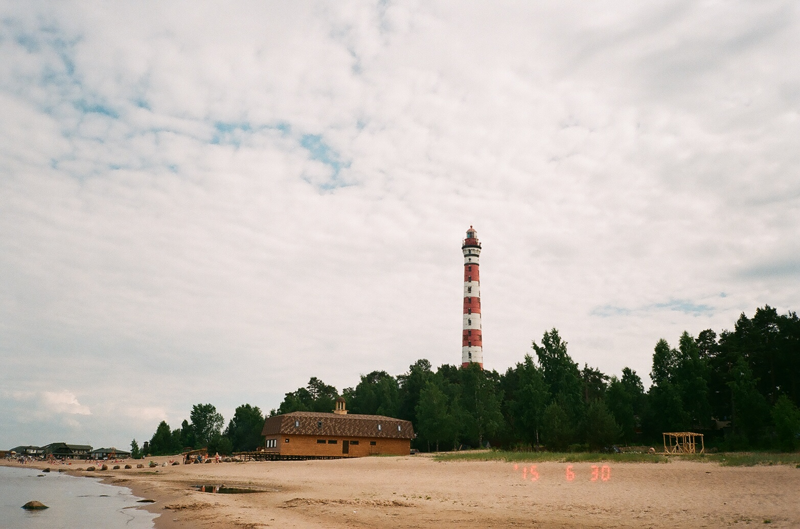
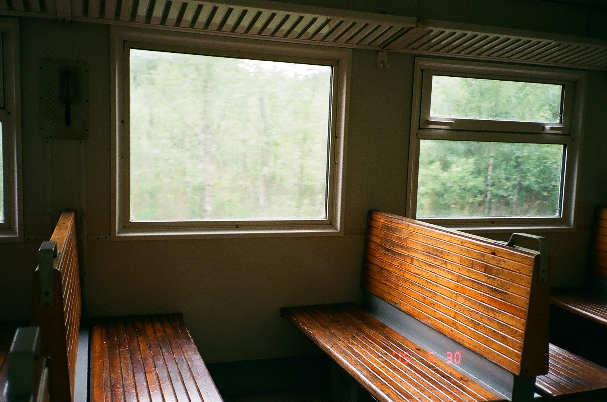
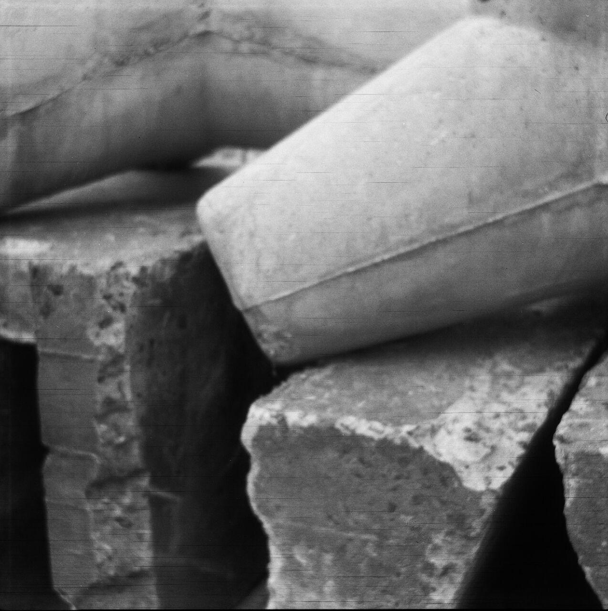
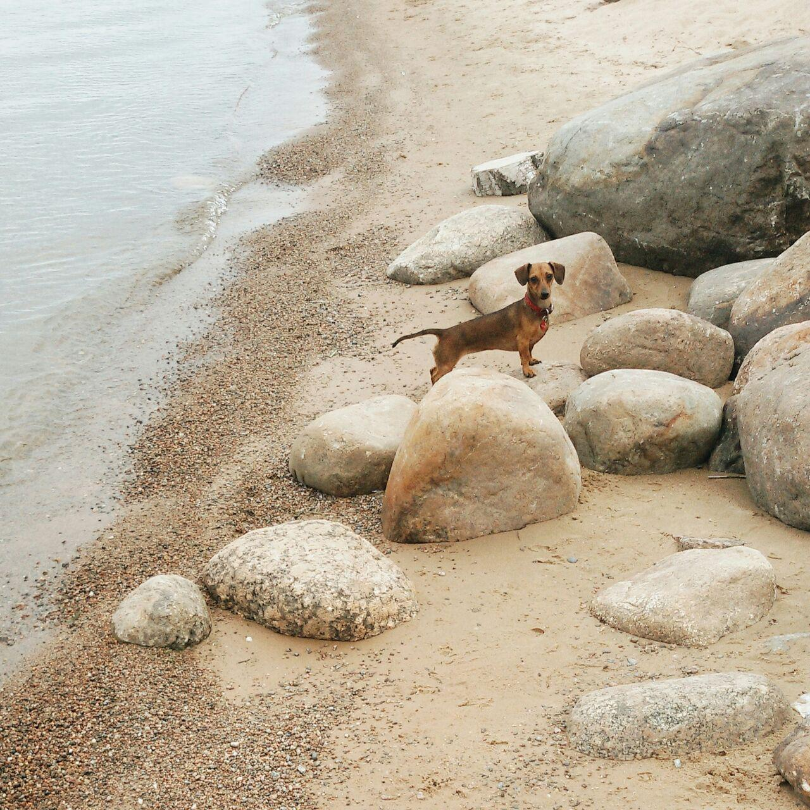
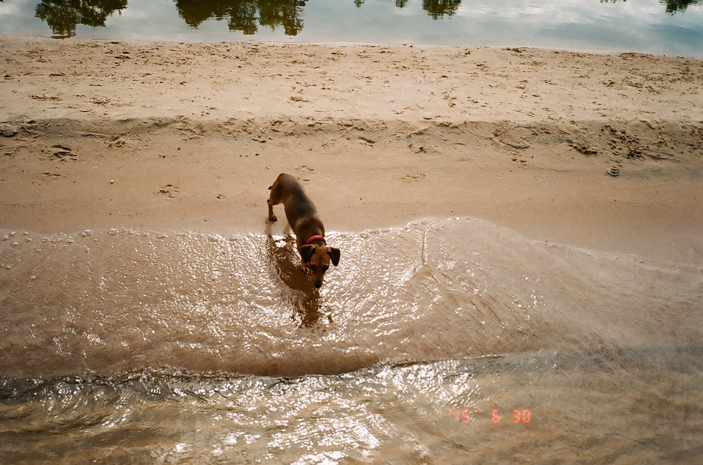
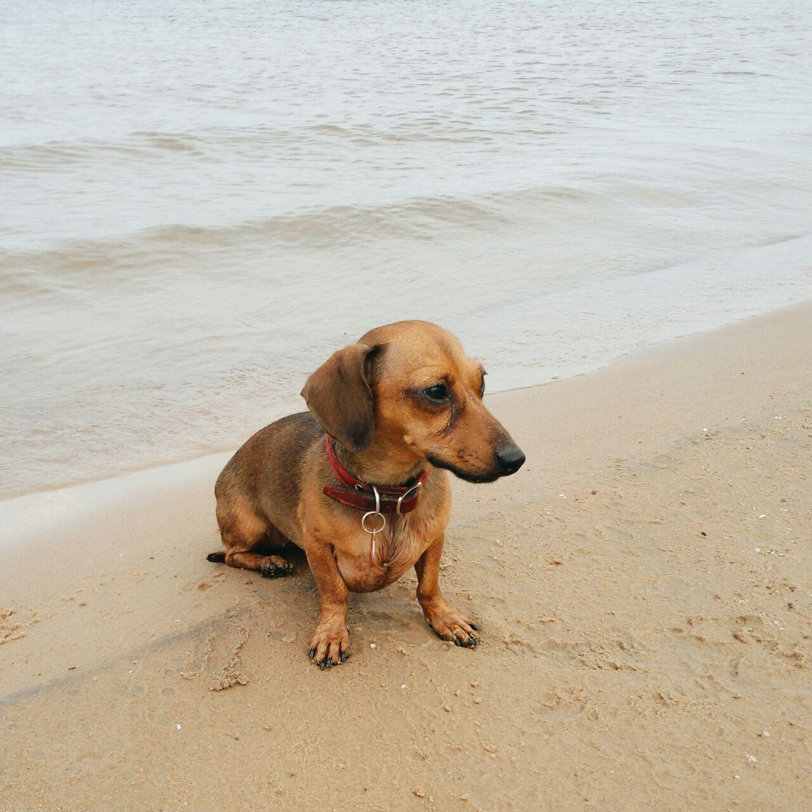
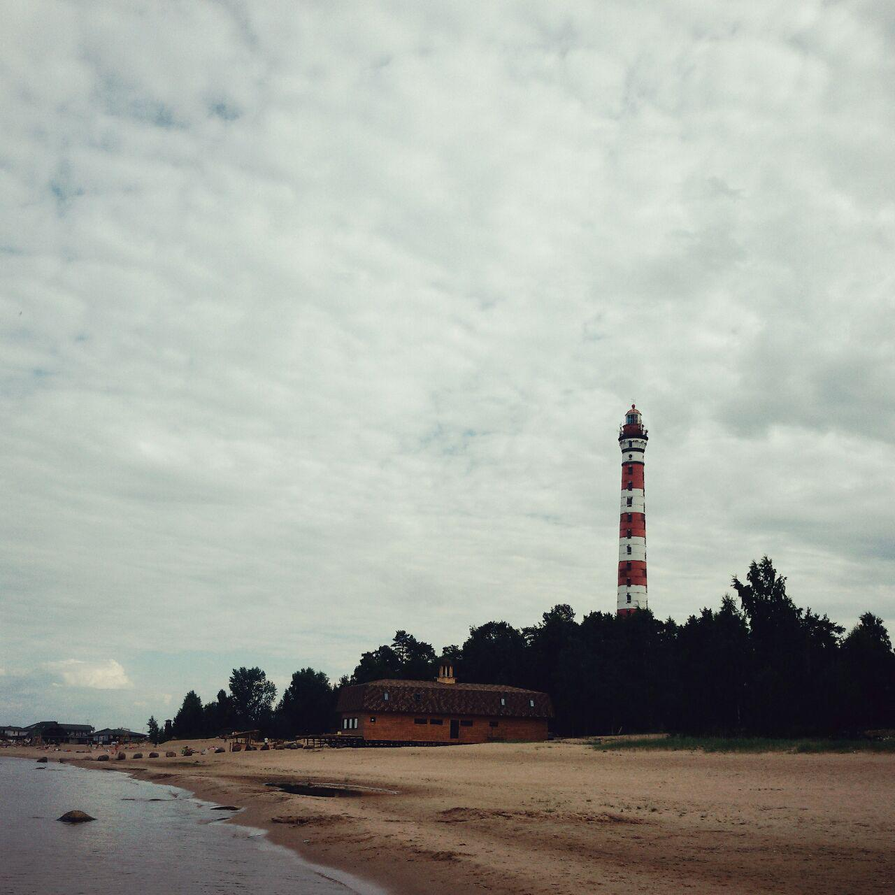
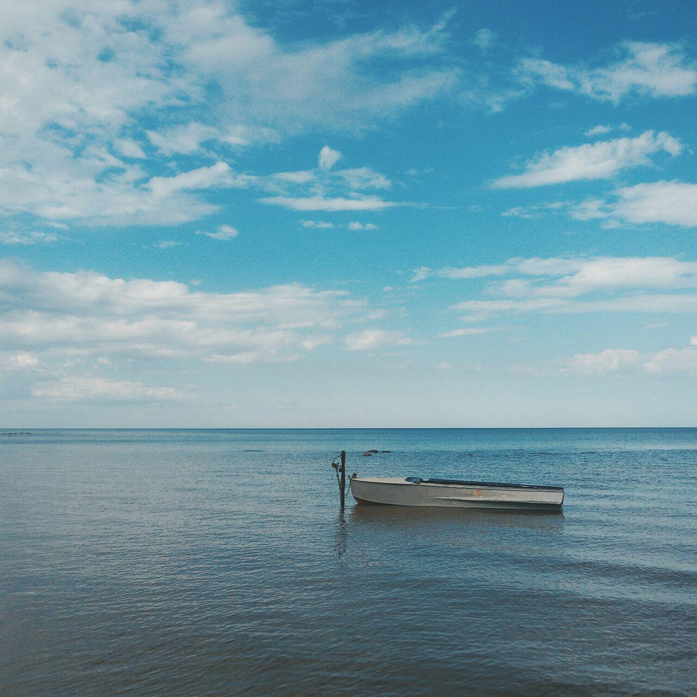

# Осиновецкий маяк: Маяк и Ладожское море

## Удобная альтернатива заливу

Ладожское озеро большое, как море. Одно из самых доступных и приятных для отдыха мест на его берегу - Осиновецкий маяк. Красивый и чистый пляж, прекрасный вид на маяк, близость станции, наличие магазинов, кафе и даже музея - неплохое комбо для пикника.

## Камни, пляж, музей и, конечно, МАЯК

Мне нравится думать, что у Петербурга два моря: Финский залив и Ладожское озеро. Хотя, конечно же, Ладога - это озеро, но зато совершенным образом непостижимо бескрайнее! Когда стоишь на берегу, невозможно даже представить, где оно может заканчиваться.

Погожим северолетним деньком я взяла под мышку собаку и отправилась на берег Ладоги, к Осиновецкому маяку. Электрички до станции Ладожское озеро ходят от Финляндского вокзала, езды минут сорок. Вагоны на этой ветке колоритные, старые, с деревянными лавочками. Можно без труда доехать к маяку на машине по шоссе и не отсиживать себе части тела на узких реечках, но за атмосферу ведь тоже надо платить.

Сразу на станции начинаются мемориалы, посвященные Дороге Жизни. Именно к Осиновецкому маяку прибывали во время блокады Ленинграда караваны с зерном, именно отсюда эвакуировались мирные жители. Недалеко от станции также есть музей, выставка техники. Всё это можно при желании посетить.

До озера идти совсем недалеко, минут пять, по дороге есть парочка маленьких магазинов, где можно купить еды. Берег каменистый, вход в воду не самый комфортный. Чтобы искупаться, лучше пройти по берегу до маяка, там хороший пляж и песчаный берег.

Если следовать вдоль воды, то придется перелазить через камни и волнорезы. Кто боится препятствий, может идти по шоссе!

Возле маяка пляж чистый, ухоженный, за ним следят. Есть кафе, сдаются в аренду беседки для шашлыка. В кафе можно поесть рыбу, выловленную непосредственно в озере.

Ладога редко бывает спокойной, и почти никогда - теплой. Ну а погода, как обычно в Ленинградской области, крайне переменчива. Отдыхающие в основном развлекаются на песке, в воду лезут только самые отчаянные. Моя собака, например. Она потом об этом пожалела и попросилась на ручки, потому что подул свежий северный ветер.

Маяком можно любоваться только снаружи, но он очень хорош. Стройный, высокий, полосатый! Не каждый маяк может похвастаться таким ростом и фигурой. Говорят, внутри 366 ступеней - как количество дней в високосном году.

Погода в тот день менялась несколько раз. За пару часов, что мы провели на пляже, удалось полюбоваться и волнующейся водой, и идиллическими картинами застывших лодочек под голубыми небесами.

Назад добираться очень легко, до станции идти всего ничего, электрички ходят достаточно часто.

## Место для созерцательных пикников у воды

К Осиновецкому маяку хорошо приезжать, если вы любите маяки, пляжи, но не очень любите купаться. Для купания лучше выбрать другое озеро или Финский залив: Ладога слишком непредсказуема и холодна. Но устроить на Ладожском озере потрясающий пикник на чистом берегу с прекрасным видом - отличная идея. Можно даже не бояться переменчивой погоды, потому что есть куда спрятаться, а еще всегда можно вскочить в электричку и сбежать домой.