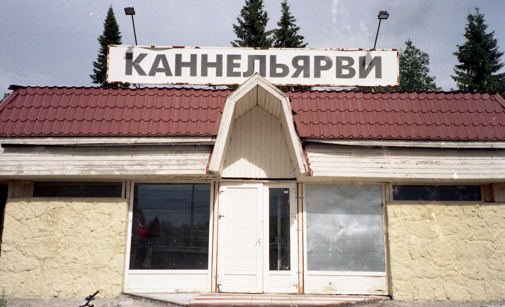
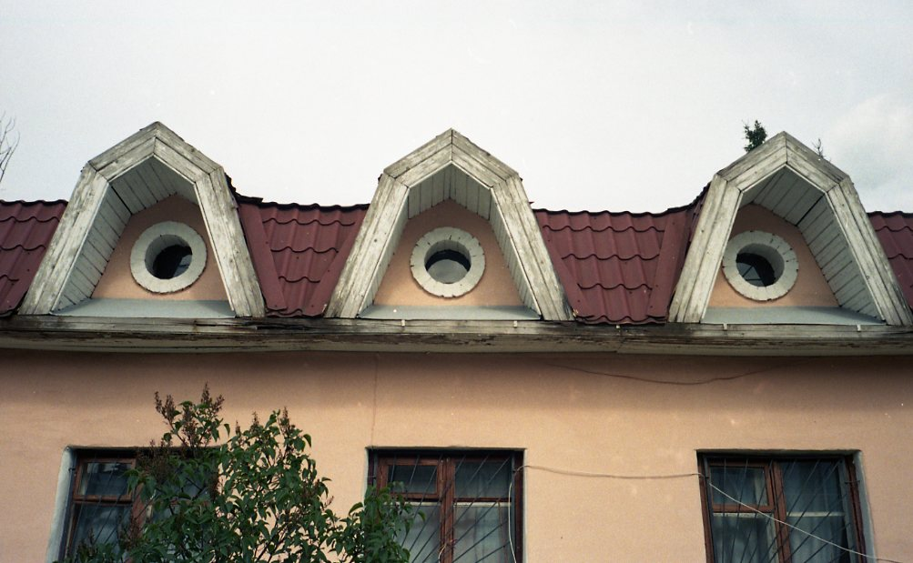

# Нахимовское озеро: Лучше, чем ничего

## Рядовой Нахимов

Нахимов, конечно, был адмиралом. Но Нахимовское озеро - рядовое. Красивое, длинное, милое, но - обычное. Делать там нечего, гулять толком негде, специально к нему я бы не поехала. Впрочем, я все равно провела там день и, может быть, кому-то это озеро придется по душе.

## Глава, в которой все идет не по плану

А план был такой: приезжаю на станцию с шикарным названием Каннельярви, через пять минут оттуда отправляется автобус до Семиозерья, где меня должны были ожидать невозможно живописные места. До станции я доехала успешно, и она хороша. Насколько вообще может быть хороша маленькая железнодорожная станция в часе езды от Петербурга.

А вот на этапе посадки в автобус все пошло наперекосяк. Дачники столпились на остановке, время отправления уже давно прошло, но автобус стоял закрытый, пустой и неживой. Водителя не было, дачники начали роптать. Через некоторое время прибежал парниша и захлебываясь от возбуждения поведал, что водителя забрали в полицию, что он нелегал и попался, сидит теперь в полиции, свободы ему не видать и вообще он был редиска, пропойца и даже водитель из него был никудышний. Дачники выслушали эту захватывающую историю и сразу же разделились на два лагеря: на тех, кто верил в невиновность водителя и собирался ждать его скорого освобождения и возвращения к своим обязанностям и тех, кто стал объединяться для вызова такси.

Я не верила в чудесное освобождение водителя, а на такси не хватило бы наличных. И что я сделала, я просто села на другой автобус. Он ехал в совершенно противоположную сторону, но проезжал мимо Нахимовского озера, про которое я совершенно ничего не знала, просто увидела на карте. Большое вроде озеро, автобус отправляется вот прямо сейчас, почему бы не поехать, правда? Это в любом случае лучше, чем возвращаться назад в Петербург.

Маленькие прыткие автобусики, рассекающие по Ленобласти, лихие гонщики полей! Потрепанные кресла скрипят, в окошки свистит ветер, колеса задорно подпрыгивают на кочках! Пассажиры: девушка с вязанием, бабули с корзинами и раздетая до пояса, загорелая шпана. И я, чужак на этой вечеринке, не знающая где выходить и уставившаяся на карту в смартфоне.

Я так подгадала, чтобы до озера было ближе всего пройти, и попросила водителя остановиться. Взвизгнули покрышки, взметнулась пыль, автобус резко притормозил у обочины и выплюнул меня наружу.

Я пошла к озеру, путь пролегал через дачи, довольно пафосные и богатые, все с заборами. И безлюдные. Кое-где за заборами были видны люди, но по улицам никто не ходил, не бегала детвора, было тихо. Зато я наслушалась жужжания мух. Пару раз мне пришлось через забор спрашивать дорогу до озера, потому что я заплутала среди домов и карта не помогала.

Но вот наконец озеро, малюсенький пляж, единственный и безлюдный. Само озеро красивое. Длинное, узкое, чистое. Опять же, людей почти нет, только звуки природы вокруг, плеск воды.

На пляжике был небольшой деревянный пирс, закрытый воротами. Впрочем, перелезть через них не составило никакого труда, и я всласть насиделась на теплых досках, наслаждаясь тишиной и отсутствием публики.

Затем я немного прошла вдоль берега, но тропы там дикие и нехоженые, да и интересного ничего нет. Нашлась еще пара лодочек. И чего ни сделаешь со скуки: залезла в лодку, посидела в ней.

Потом я просто пошла назад, словина обратный дискоавтобус, добралась до Каннельярви и уехала домой. По пути еще черники в лесу набрала, но черники на Карельском перешейке везде много.

## Нетривиальный выбор

Нахимовское озеро стоит посетить, если у вас где-то недалеко есть дача или вы выбрали туристическую базу в этом районе. Либо если вы хотите совершить бездумное путешествие ради путешествия, посидеть у воды в полном отсутствии людей. Во всех остальных случаях там делать нечего.