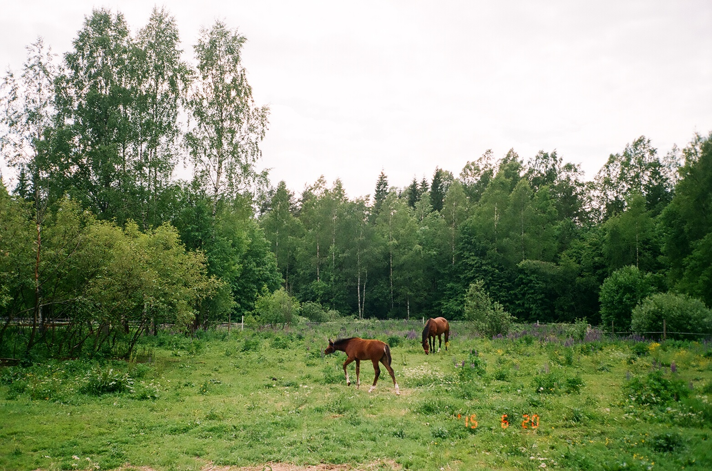
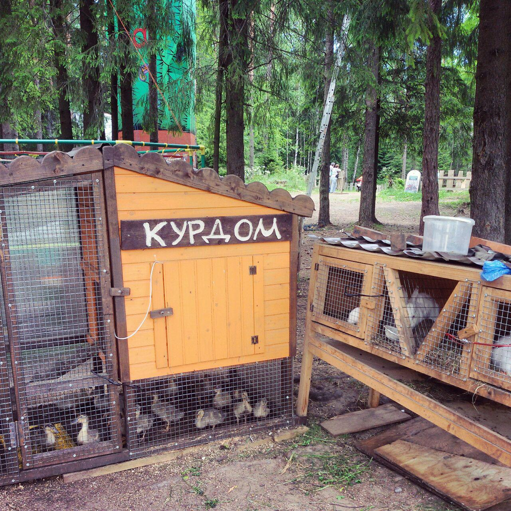
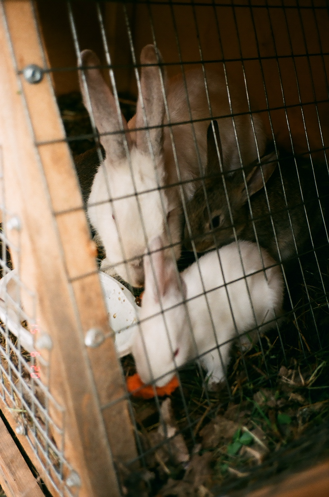
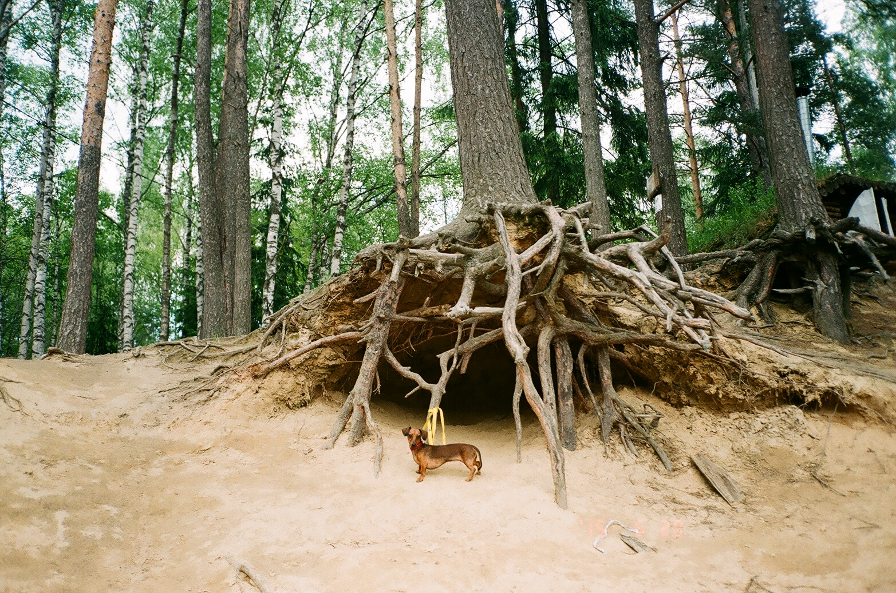
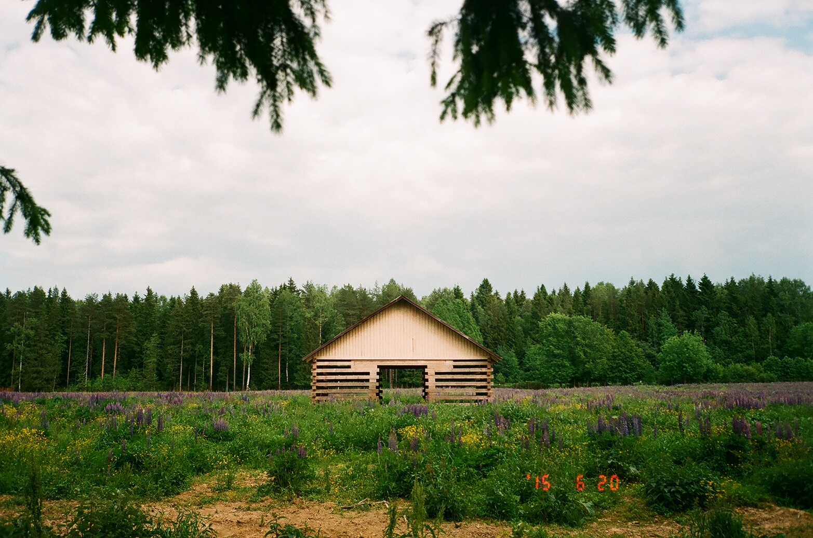
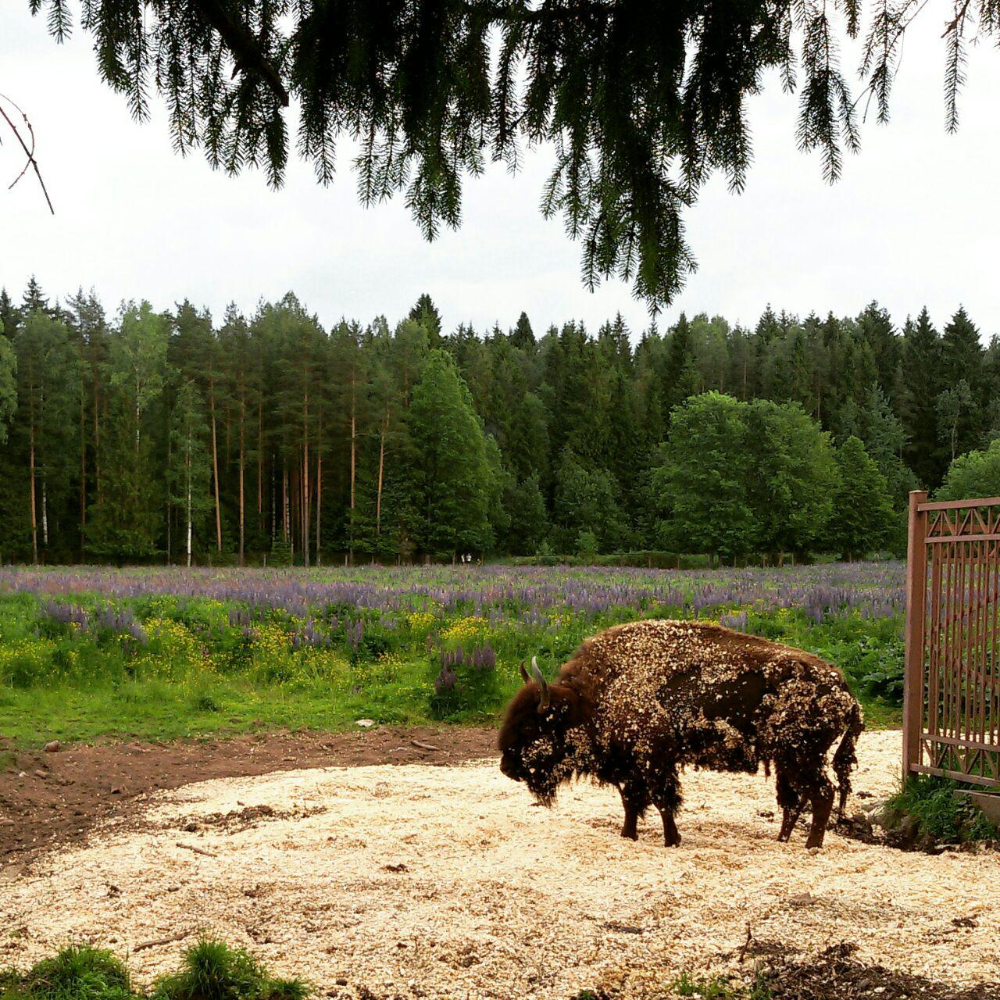

# Токсово: Лесопарк, зубропитомник и экотуризм

## Погладить ослика

Да, это можно сделать в зубропитомнике в Токсово - погладить ослика, кроликов, покататься на лошадке, развлечься в веревочном парке, посмотреть на зубров, покормить их яблоками, устроить пикник… Лучше всего приезжать в зубровник с детьми, им точно будет интересно познакомиться с животными. А вот собак брать не стоит, особенно если вы не уверены, как ваш питомец отреагирует на огромных копытных собратьев.

## Душеспасительный экотуризм

В Токсово главным образом меня интересовал парк семейного отдыха “Зубровник”, мне хотелось посмотреть вблизи на зубров, я их никогда не видела. Поехала я туда вместе с собакой.

Добираться до зубропитомника лучше всего, на мой взгляд, на электричке. Если поехать на машине или маршрутке от Проспекта просвещения или Девяткино в выходно день, можно провести много времени в пробках в районе Мурино (я как-то ездила на маршрутке в Кавголово - это был ад). А на электричке доехать можно быстро и без проблем. От станции Токсово к “Зубровнику” ходит маршрутка 491, маленький и довольно редкий автобус. Но можно дойти пешком по прямой дороге прямо до парка. Идти минут 45.

К тому же, если идти пешком, по пути вам встретится небольшое озеро, где можно устроить привал. Озеро совсем компактное, вокруг него сдаются в аренду небольшие землянки для шашлыков, есть веревочный парк, мини-мини-ферма с кроликами и уточками.

Мне не удалось всласть насладиться обществом курочек, потому что моя охотничья собака начала сходить с ума. И мы просто передохнули на берегу, он песчаный и с красиво размытыми корнями деревьев. Такие открытые корни часто встречаются на Карельском перешейке, мне очень нравятся.

Еще немножко ходьбы вдоль шоссе, и мы наконец пришли к “Зубровнику”. Вход туда совершенно бесплатный. В “Зубровнике”, как можно догадаться, живут зубры. У них большой-большой выгон, огороженный забором, и какие-то их зубрячьи домики-беседки.

Возле забора насыпаны опилки и зубры в основном сидят именно там, в тени и поближе к посетителям. Гости несут зубрам яблоки, капусту. У меня ничего с собой не было, но добрые люди дали мне пару яблок, чтобы я угостила зубра. Всего их там 4 или 5 крупных особей. Я протянула руку через забор и зажмурилась, но зубр очень деликатно мягкими губами (или языком? Я ж не видела) взял у меня яблоко и за секунду схрумкал. Собаку мне пришлось привязать к дереву подальше от забора, потому что она гавкала, топорщина холку и пугала больших флегматичных зубров. Точнее, она им просто досаждала бессмысленным шумом.

Дальше в парке есть мини-ферма, веревочный городок, батуты, катание на лошадках, кафе. Все эти услуги уже за отдельную плату. На мини-ферму я не смогла пойти, опять же из-за собаки. Взять её с собой, как вы уже поняли, было ошибкой. Пса я почти все время держала на руках, чтобы она не гавкала и не кидалась на лошадок. Но мини-ферма хорошая, там есть ослик, козы, овцы, кролики, петухи. Парк ухоженный, чистый.

Мы пошли бродить по территории, вокруг простирается живописный Токсовский лесопарк. Можно просто ходить по дорожкам в лесу, кое-где попадаются организованные площадки для пикников и шашлыков. Неплохо можно покататься на велосипеде или просто погулять на природе.

Все эти пасторальные пейзажи и добрые животные вокруг действуют очень умиратворяюще, прогулка наполнила меня ощущением благости.

Назад до станции мы доехали на автобусе, сели на электричку и через двадцать минут уже были в Петербурге.

## Детям понравится

Мне кажется, в такие места, как “Зубровник”, лучше всего ехать с детьми. Они точно оттянутся по полной, будет чем заняться. Полезно будет показать, как выглядит обычный домашний скот. Взрослым без детей, возможно, будет скучновато. Для простых прогулок можно выбрать и другой парк, где не будут бегать дети и животные. И уж точно я не советую брать в Токсово собак!