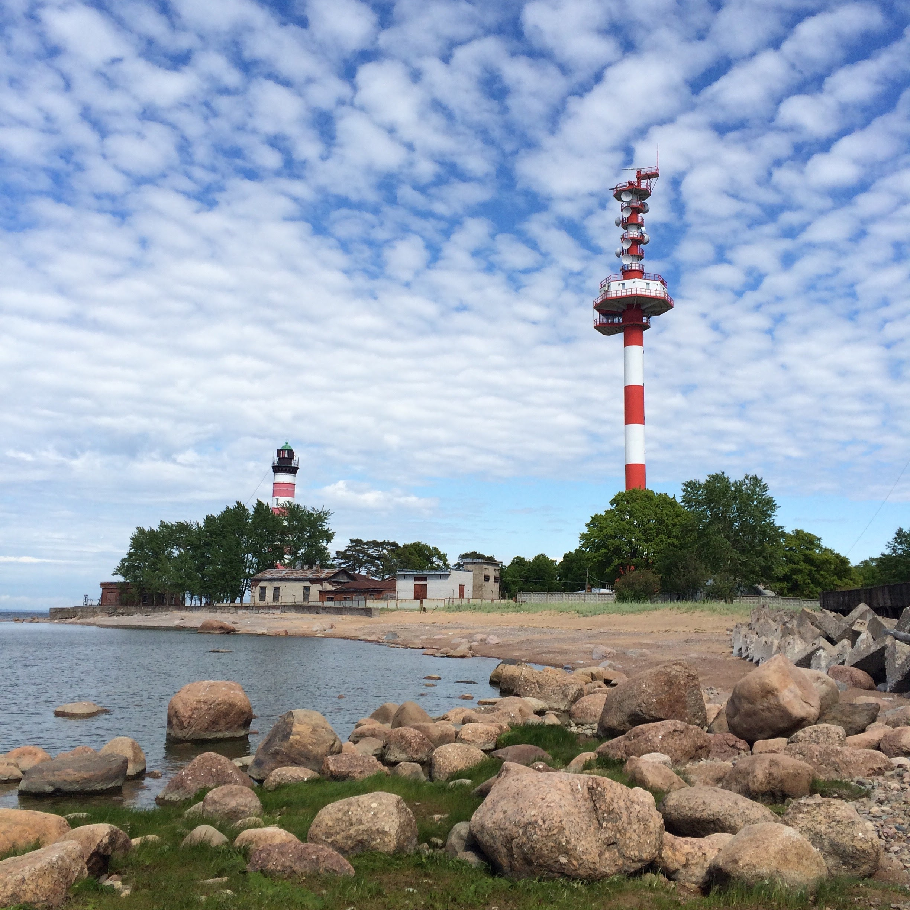
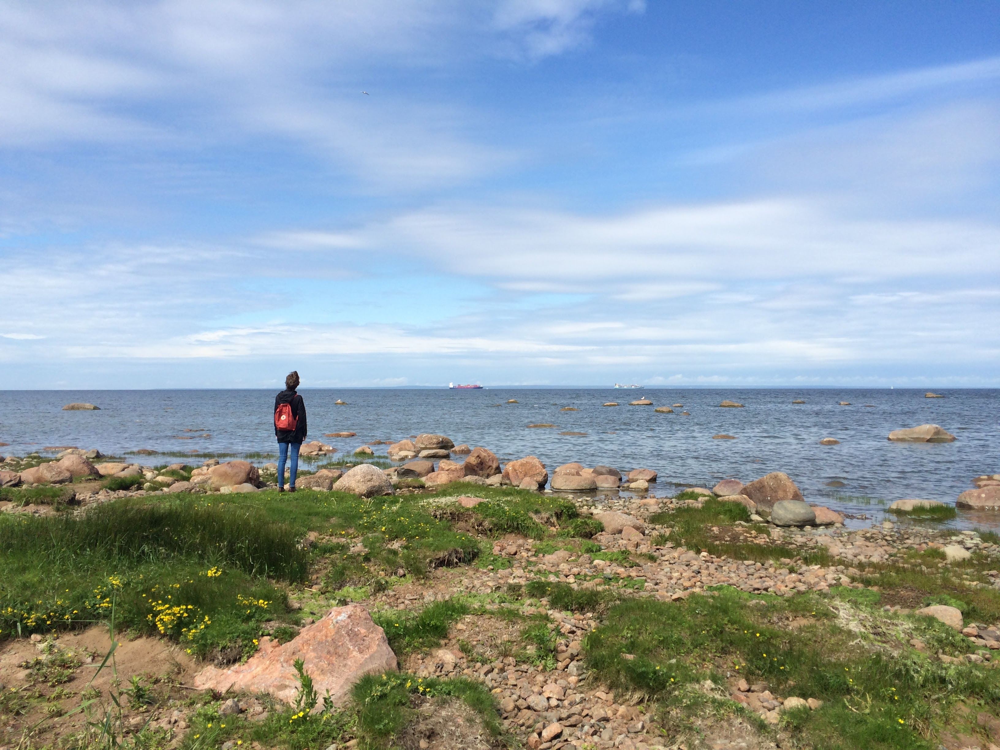
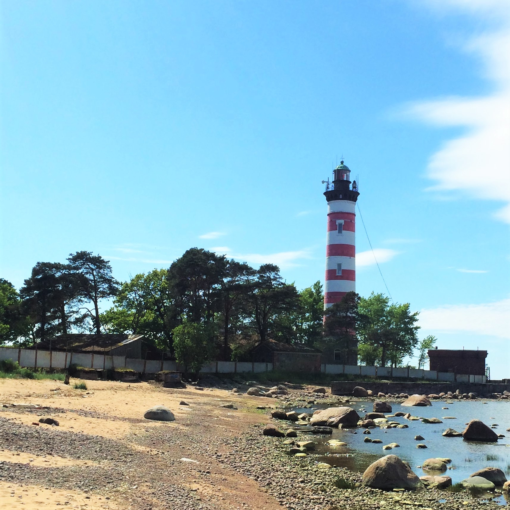

# Шепелёвский маяк: На зов моря

## Из любви к маякам

Я люблю маяки. Всякие: худые и высокие, приземистые и коренастые, деревянные и каменные, полосатые и белые. Размер и форма не имеет значения, главное, чтобы маяк просто был! Звать и притягивать внимание - в самой маяковской природе.

К Шепелёвскому маяку стоит ехать, если вы, как и я, любите море и маяки. Точно получите удовольствие.

## Вода, камни и массивные металлоконструкци

На машине я езжу редко, потому что нет ни прав, ни машины. Но в тот день мы решили выбраться небольшой компанией и на колесах. Маяк находится на южном берегу Финского залива, мы живём на севере города, поэтому поехали по КАДу через Кронштадт.

Это замечательный путь, если нет пробок! Ехать по дороге прямо посередине воды, с ветерком, к маяку, что может быть лучше. КАД проехали легко, но вот дальше шоссе было не в самом лучшем состоянии. Ближе к маяку есть магазин “Пятёрочка”, там можно взять еды с собой, или покупать заранее. Потому что дальше уже никаких магазинов и инфраструктуры нет.

Припарковались возле леса и прошли через него пешком. Накануне случился небольшой дождь, воздух был чистый и свежий, лесной и дождевой одновременно, в общем идеальный. До воды идти совсем недалеко, если подъехать поближе.

И вот он, каменистый берег, пробивающаяся кое-где трава, яркая вода. Облака разбегаются после дождя, обнажая светлое голубое небо, оно отражается в море.

И красавец маяк. Он не очень высокий, чугунный, полосатый. Не худой и не очень толстый, ладненький такой маяк.

Можно ходить вокруг, но к самому маяку близко подойти не получится.

Рядом расположена радиобашня, она в два раза выше маяка, с большой шапкой радаров наверху, наподобие самбреро. Из-за этой большой вышки маяк немного теряется и кажется ниже, но вместе они, тем не менее, составляют отличный бело-красный ансамбль.

Людей почти совсем не было, всё-таки добираться до Шепелёвского маяка не так быстро и удобно, как до Осиновецкого, например. По берегу можно идти довольно далеко, но будьте осторожны и грамотно выбирайте обувь: придется скакать по камням.

Повсюду услада для глаз любителей волнорезов и массивных металлоконструкций:

Мы дважды устраивали привал с пикником: сначала на подходе к маяку, потом обогнули его и еще долго сидели на солнышке, на горочке с обратной стороны.

## Маяк стоит свеч

Это чудесное место с прекрасным видом и вдали от людей. Подойдёт каждому любителю моря, маяков и уединения. Добираться лучше всего на машине, берите с собой еду и надевайте подходящую обувь. Путь не близкий, но он того стоит.