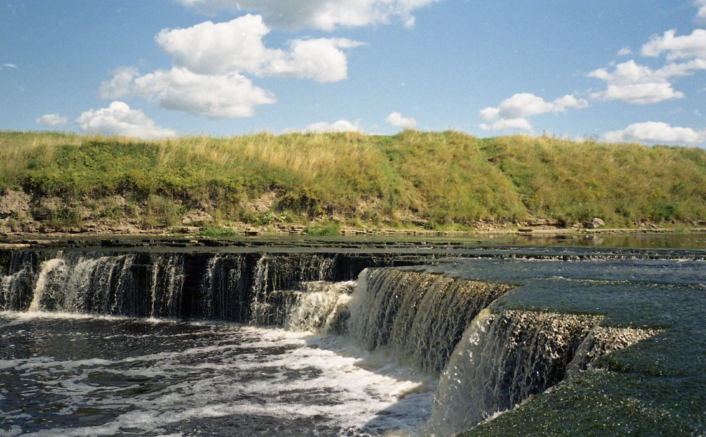
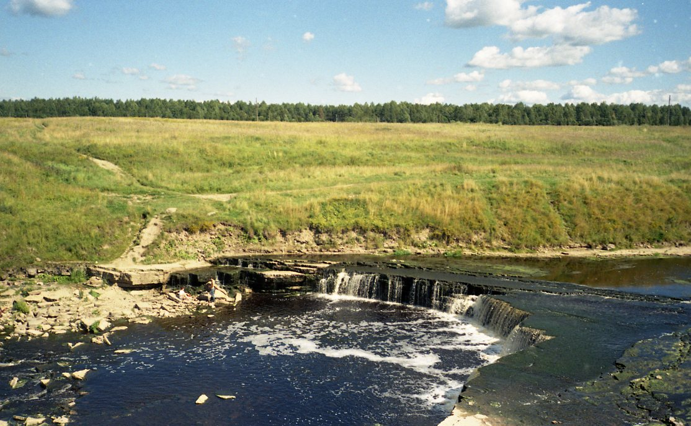
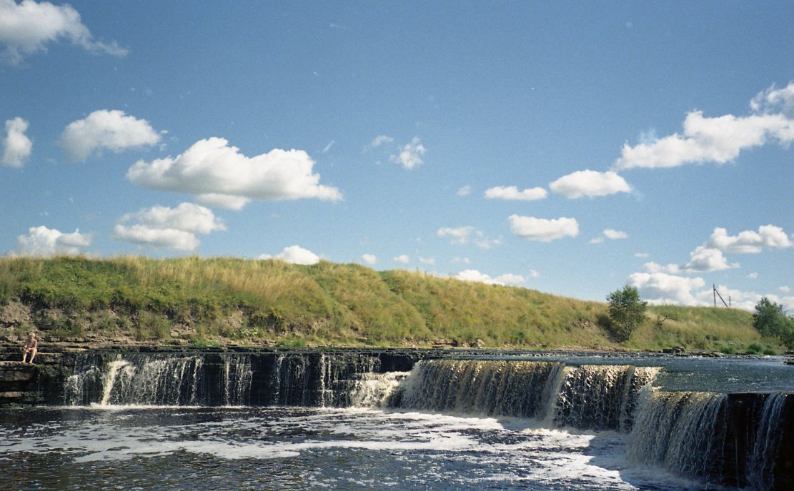
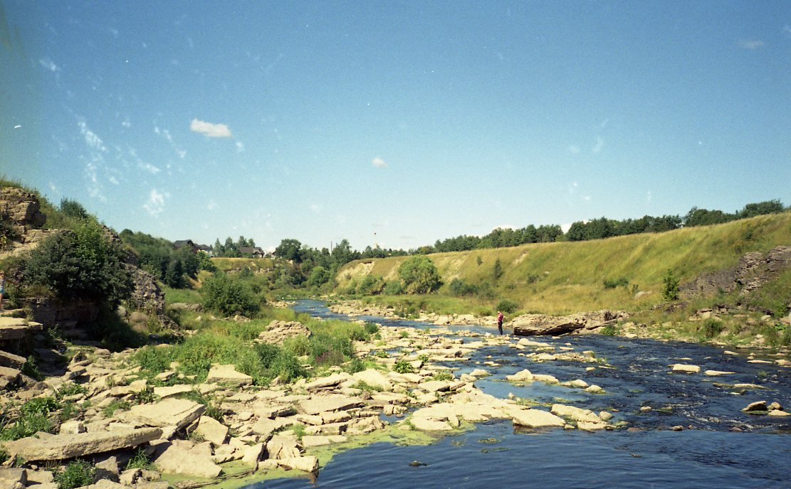
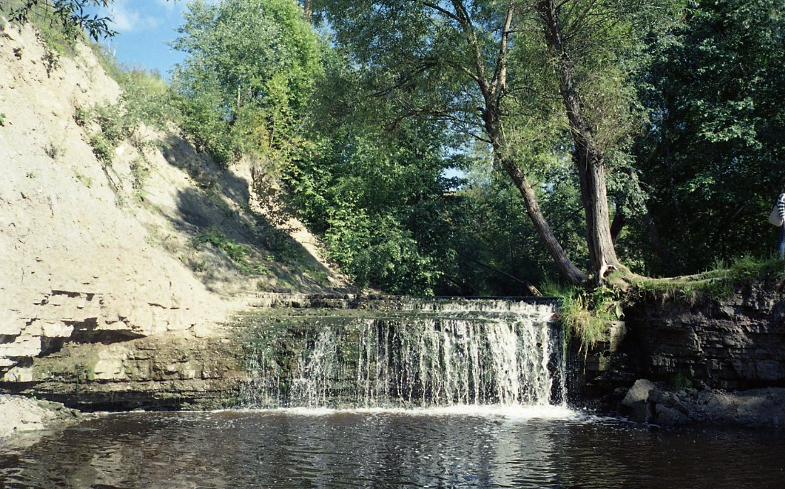

# Саблино: Водопадовый тандем

## Удивительное рядом

Невероятно, но в Ленинградской обсласти есть водопады! Целых два в одном месте: Саблинский и Тосненский. Оба такие классные, что даже не верится глазам. Совершенно непонятно, почему так мало людей знает об этом чуде. Хотя, может быть это и к лучшему. Часто бывает, что излишняя популярность выходит природке боком.

Еще на окраине посёлка есть Саблинские пещеры, но в них так просто не попасть, нужно заранее заказывать экскурсию.

## Такие разные, и почти в одном месте

Добираться до станции Саблино проще простого: всего минут двадцать на электричке от Московского вокзала. Расположенный на этой станции небольшой посёлок Ульяновка не так прост, как может показаться. Во-первых, там умуневероятная инфраструктура с магазинами, палатками с одеждой и даже ПОЧТОЙ. Во-вторых, фантастический ансамбль природных памятников: водопады и пещеры.

Итак, небольшая поездка на электричке до станции Саблино позади. Дальше у пытливого путника, желающего усладить взор водопадами, есть выбор: идти пешком либо подскочить на маршрутке. Я ездила в очень погожий денек и решила идти пешком.

Куда точно идти, я не знала, ориентировалась по метке на карте. По посёлку разгуливали дружелюбные дачники-аборигены, и все они были рады мне помочь, подсказать дорогу. Было заметно как местные гордятся сокровищем, припрятанным на окраине их посёлка. Следуя противоречивым инструкциям, я с горем пополам добралась до первого водопада - Тосненского. Шла я примерно час. Можно было сократить путь и проехать по Советскому проспекту на маршрутке, ну а дальше направо пешком. Идти час по жаре - это всё-таки утомительно, даже несмотря на то, что на станции я купила холодной воды и по дороге мне попалась парочка мелких магазинчиков, где было мороженное.

Впрочем, о всякой усталости вмиг забываешь, когда выходишь из-за кустов и видишь ВОТ ТАКОЕ:

Тосненский водопад на реке Тосна большой, просторный, шумный. Река в этом месте совсем неглубокая, берег каменистый. Можно без труда перейти на другую сторону, посидеть на одном и на другом берегу, можно побродить по камням. Однако будьте осторожны, если решите пройтись по верхней части водопада, откуда поток срывается вниз: там скользко и течение очень быстрое, немудрено сорваться. Отдыхающих было совсем немного, некоторые подъезжали на машине.

Вдоволь нагулявшись по воде, насмотревшись на нее и наслушавшись, я отправилась на поиски второго водопада - Саблинского. На реке Саблинке. Пошла опять пешком, потому что после водички всегда свеженько.

С поиском этого водопада возникло чуть больше проблем. Не все дачники знали, где он, а метка в гугле на тот момент, по крайней мере, была какая-то невнятная. А в итоге всё оказалось не так и сложно, нужно просто от Советского проспекта свернуть на 10-ую улицу, дойти до её конца и дальше по тропинке, она там протоптанная. А мне вообще повезло: я увязалась за мальчишками.

Саблинский водопад совсем другой. Он камерный, закрытый, маленький и лесной. Такой водопад-интроверт, по сравнению в Тосненским, который весь из себя шумный и нараспашку. Но в обоих случаях я была очарована наповал.

Эту речушку также можно перейти вброд, но нужно быть еще более осторожным на скользких камнях. Пару раз я чуть не плюхнулась вместе с фотоаппаратом, благо удалось схватиться за ветки. В идеале лучше всего подобрать обувь, чтобы можно было её мочить и чтобы было не скользко. Я вот не позаботилась, не подумала. Босиком по камням точно неудобно, а мои босоножки проскальзывали.

В лесочке было хорошо и нежарко, я там посидела и пошла восвояси. Следующим пунктом значились Саблинские пещеры, для этого нужно было пройти Советский проспект до конца и немного налево.

Но с пещерами мне не повезло, так просто туда не попасть. Нужно заказывать и оплачивать экскурсию через сайт, и входить только с проводником. Потоптавшись вокруг и почитав запрещающие вход таблички, я отправилась назад на станцию, шла пешком через проспект, рвала иргу. Садиться в маршрутку не хотелось. На посёлок спустилась мягкая вечерняя прохлада, идти было весело и хорошо, а в душе искрился и шумел маленький и светлый водопадик.

## Стоит повторить

К Саблинскому и Тосненскому водопадам лучше всего ехать в хорошую погоду. Можно не брать ссобойку, потому что в поселке хватает магазинов. А вот насчет обуви лучше подумать заранее: она должна быть удобной и непромокаемой, если вы хотите переходить речки вброд. У водопадов можно загорать, устраивать пикники, а еще это прекрасное место для фотосессий.

Я обязательно вернусь туда опять: повеселиться с друзьями, провести время с семьёй и собакой. А может и одна, подумать и поглядеть на потоки воды.

## Координаты водопадов

Водопад Саблинский на реке Саблинка: 59°39′40″ с. ш. 30°47′06″ в. д. (G) (O)

Водопад Тосненский на реке Тосна: 59°38′40″ с. ш. 30°48′31″ в. д. (G) (O)